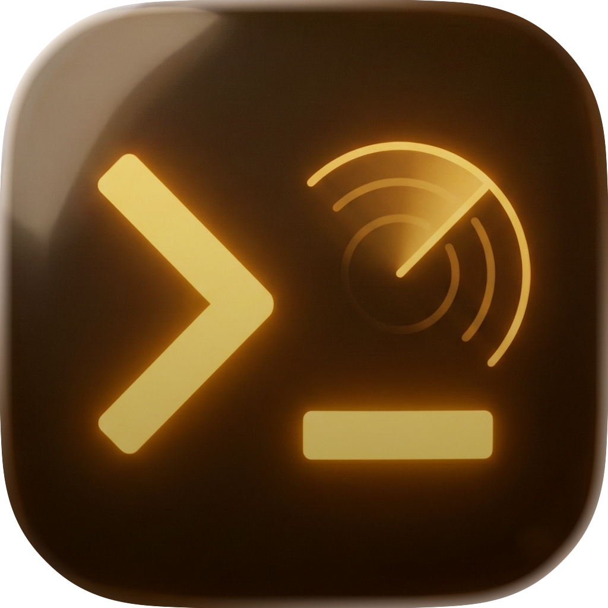

<p align="center">
  
</p>

<h1 align="center">Weaver</h1>

<p align="center">Fleet orchestration and session monitoring for Claude Code agents with MQTT-based Brain connectivity.</p>

**Weaver** is a desktop app that monitors Claude Code sessions and orchestrates them as a distributed fleet via MQTT. Built on top of [c9watch](https://github.com/minchenlee/c9watch), it adds:

- **MQTT Integration** - Connect to ContextHub Brain message broker
- **Fleet Management** - Coordinate multiple Claude Code instances across machines
- **Mission Orchestration** - Distribute plan execution across agents
- **Heartbeat Publishing** - Real-time session status to fleet dashboard
- **Assignment Handling** - Receive and execute tasks from Brain

## Architecture

```
Weaver = c9watch (session monitoring) + MQTT (fleet coordination)
```

**Session Monitoring (from c9watch):**
- Discovers Claude Code sessions automatically by scanning OS processes
- Tracks session status: Working, Waiting for Input, Needs Attention, Idle
- Parses JSONL conversation logs for message history and cost tracking
- Opens sessions in VS Code + iTerm with tmux persistence

**Fleet Coordination (new):**
- Publishes session updates to MQTT topics (`fleet/sessions/{session_id}`)
- Sends heartbeats to Brain (`fleet/heartbeat`)
- Subscribes to assignment topics (`fleet/assignments`)
- Bridges MQTT messages to WebSocket for browser dashboard

## Works with everything. Tied to nothing.

Like c9watch, **Weaver doesn't care where you start your sessions**. It discovers them automatically at the OS level.

Start Claude Code from any terminal or IDE -- VS Code, Zed, iTerm2, Cursor, Windsurf -- and Weaver picks them up. No plugins required. No workflow changes. Just monitoring and orchestration on top of what you're already doing.

## Lightweight and fast.

Built with **Tauri 2**, **Rust**, and **Svelte 5** -- not Electron. The app is small, memory-efficient, and snappy. Rust handles process scanning, MQTT publishing, and file parsing at native speed. Svelte compiles away framework overhead.

## Install

### Prerequisites

- [Rust](https://rustup.rs/) (1.70+)
- [Bun](https://bun.sh/) or [Node.js](https://nodejs.org/) (v18+)
- [Tauri CLI](https://v2.tauri.app/start/prerequisites/)
- MQTT broker (Mosquitto, HiveMQ, or ContextHub Brain)

### Build from source

```bash
git clone https://github.com/contexthub/contexthub-weaver.git
cd contexthub-weaver
bun install
bun run tauri build
```

The built `.app` will be in `src-tauri/target/release/bundle/macos/`.

### Development

```bash
bun run tauri dev
```

Opens the app with hot-reload enabled.

## Configuration

Create `~/.contexthub/weaver.toml`:

```toml
[mqtt]
broker_host = "localhost"
broker_port = 1883
client_id = "weaver-{auto-generated}"
username = "your-username"  # optional
password = "your-password"  # optional
keep_alive_secs = 30

[fleet]
instance_id = "{auto-generated}"
workspace = "/Users/you/projects"
capacity = 5
```

## Usage

### Monitor Tab (c9watch features)
- View all active Claude Code sessions
- Group by project or flat view
- Open sessions in VS Code + iTerm
- Stop sessions with graceful shutdown
- View conversation history and cost

### Fleet Tab (new)
- See all Weaver instances across machines
- Monitor fleet health and session distribution
- View recent task assignments
- MQTT connection status

## MQTT Topics

**Published by Weaver:**
- `fleet/heartbeat` - Instance health and session count (every 3.5s)
- `fleet/sessions/{session_id}` - Session status updates (on change)

**Subscribed by Weaver:**
- `fleet/assignments` - Task assignments from Brain
- `fleet/control/{instance_id}` - Control commands

## Forked from c9watch

This project is a fork of [c9watch](https://github.com/minchenlee/c9watch) by [@minchenlee](https://github.com/minchenlee). We extended it with MQTT and fleet orchestration for ContextHub's distributed agent system.

**What we kept:**
- Session detection and status inference
- Terminal/IDE integration (iTerm, VS Code, Zed, etc.)
- WebSocket broadcast infrastructure
- Conversation history and cost tracking
- Svelte 5 UI components

**What we added:**
- MQTT client (rumqttc)
- Fleet management page
- Heartbeat publishing
- Assignment handling
- Brain connectivity

## License

MIT (same as c9watch)

## Credits

- **c9watch** by [@minchenlee](https://github.com/minchenlee) - Session monitoring foundation
- **ContextHub Team** - MQTT and fleet orchestration
