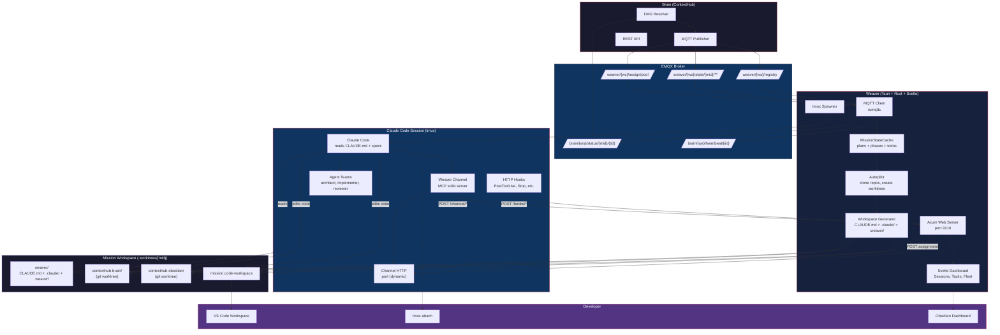
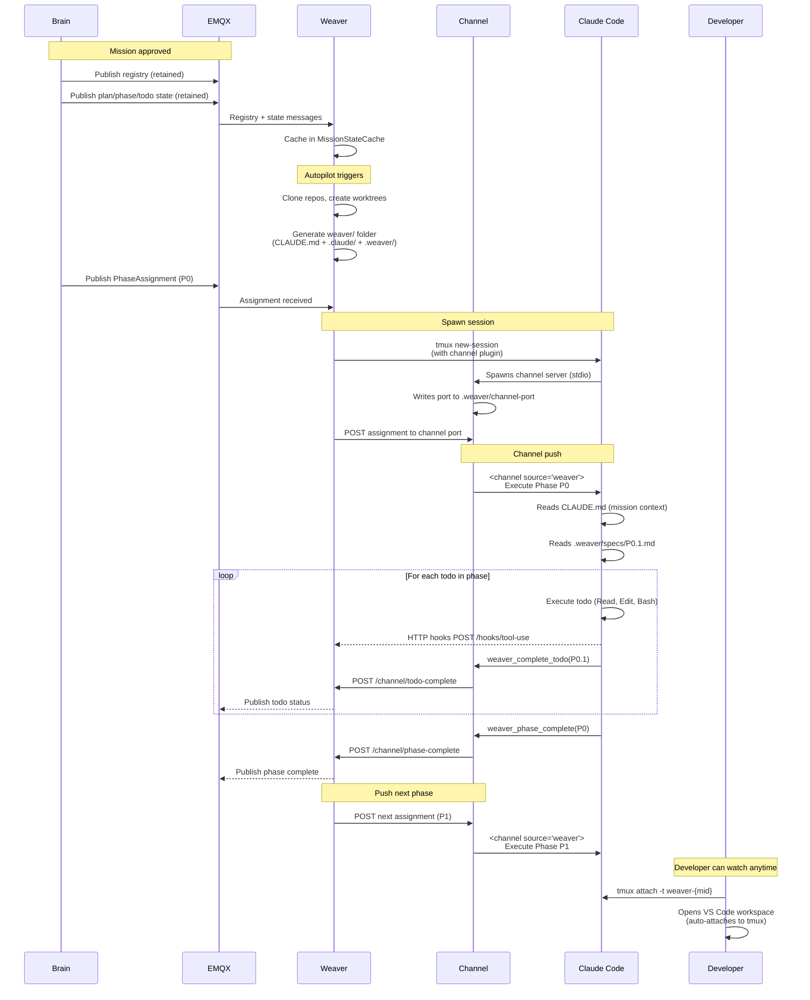
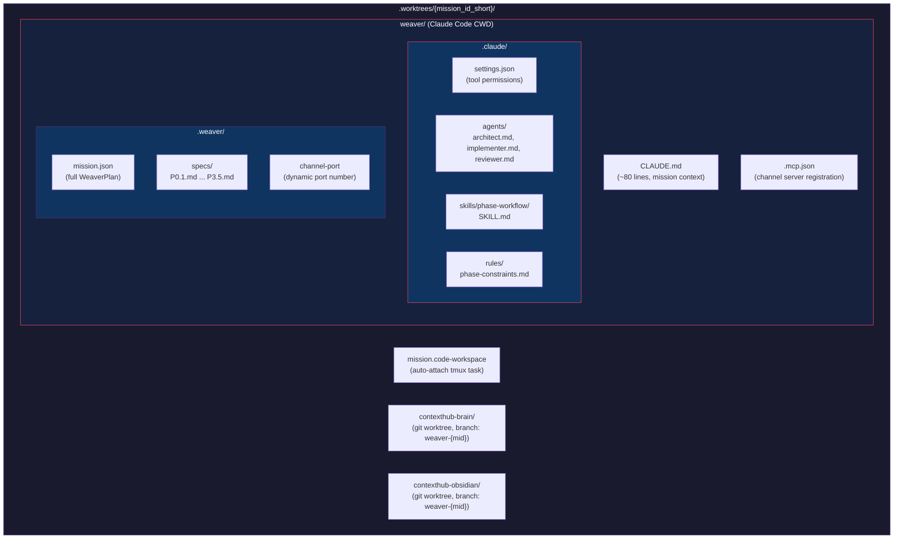

# Weaver Architecture

Weaver is a distributed AI execution platform that orchestrates Claude Code sessions across multiple devices. It receives mission assignments from ContextHub Brain via MQTT, sets up isolated development workspaces, and drives Claude Code autonomously through mission phases -- all observable in real-time.

## How It Works



### Sequence: Mission Execution



### Workspace Structure



## Core Components

### Tauri Desktop App (Rust + Svelte)

The Weaver app runs as a macOS menu bar application with:

- **Tray icon + popover**: quick session overview (NSPanel, works over fullscreen)
- **Dashboard**: tabs for Sessions, Tasks, Workspace, Fleet, Settings, Debug
- **Session monitoring**: detects running Claude Code processes, parses JSONL logs, tracks cost/tokens
- **MQTT client** (rumqttc): connects to EMQX broker, heartbeat every 30s
- **Web server** (axum, port 9210): WebSocket for mobile client + HTTP hook endpoints

### MQTT Pipeline

All Brain-Weaver communication is over MQTT. No REST API client in Weaver.

**Topics Weaver subscribes to:**
- `weaver/{ws}/registry` -- mission discovery (retained)
- `weaver/{ws}/state/{mid}/plan` -- full plan with objectives (retained)
- `weaver/{ws}/state/{mid}/phase/{pid}` -- phase config + execution target (retained)
- `weaver/{ws}/state/{mid}/todo/{tid}` -- todo spec + status (retained)
- `weaver/{ws}/assign/pool` -- phase assignments (round-robin to online instances)
- `weaver/{ws}/control/{iid}` -- abort/pause commands

**Topics Weaver publishes to:**
- `brain/{ws}/heartbeat/{iid}` -- instance health every 30s
- `brain/{ws}/status/{mid}/{tid}` -- todo completion status
- `brain/{ws}/accept/{mid}/{pid}` -- phase acceptance

**MissionStateCache** stores all retained messages and decomposes WeaverPlan JSON into plan/phase/todo entries for the workspace generator and executor.

### Workspace Autopilot

When a WorkspaceRegistryMessage arrives via MQTT, the autopilot:

1. **Clones missing repos** (shallow clone, skips if exists)
2. **Creates git worktrees** per mission on branch `weaver-{mid_short}`
3. **Generates the weaver/ folder** at the workspace root:

```
.worktrees/{mid_short}/
  mission.code-workspace          # VS Code workspace (auto-attach task)
  weaver/                         # Claude Code CWD
    CLAUDE.md                     # Lean mission context (<100 lines)
    .claude/
      settings.json               # Permissions for required_tools
      agents/
        architect.md              # Opus model, investigation
        implementer.md            # Sonnet model, code changes
        reviewer.md               # Sonnet model, tests
      skills/
        phase-workflow/SKILL.md   # Execution protocol
      rules/
        phase-constraints.md      # Active phase constraints
    .weaver/
      mission.json                # Full WeaverPlan dump
      specs/
        P0.1.md ... P3.5.md      # Per-todo spec files
    .mcp.json                     # Weaver channel server registration
  contexthub-brain/               # Clean repo worktree
  contexthub-obsidian/            # Clean repo worktree
```

4. **VS Code workspace** includes `weaver/` as first folder with:
   - Auto-attach tmux task (runs on folder open)
   - Extension recommendations from phase config
   - Build/test tasks from required_tools

### CLAUDE.md Design

Follows official Claude Code best practices:
- Under 100 lines (loaded every session start)
- Only what Claude can't infer from code
- Progressive disclosure: specs in `.weaver/specs/` loaded on demand
- Lists sibling repo paths (`../contexthub-brain/`)
- References `.claude/skills/phase-workflow/` for execution protocol

### Weaver Channel Plugin

A Claude Code plugin that bridges Weaver and Claude Code sessions:

```
weaver-plugin/
  .claude-plugin/plugin.json      # Plugin manifest
  .mcp.json                       # Channel server registration
  channels/weaver-channel/
    index.ts                      # Bun MCP server (~250 lines)
  hooks/hooks.json                # HTTP hooks -> Weaver API
  skills/phase-workflow/SKILL.md  # Execution workflow
  agents/                         # Role-based subagents
```

**Channel server** (Bun + @modelcontextprotocol/sdk):
- Declares `claude/channel` capability (push events into session)
- Listens on dynamic port (OS-assigned, written to `.weaver/channel-port`)
- Weaver POSTs assignments -> channel pushes `<channel source="weaver">` events
- Exposes tools: `weaver_reply`, `weaver_complete_todo`, `weaver_phase_complete`
- Permission relay: Weaver can approve/deny tool calls remotely

**HTTP hooks** POST to Weaver API (port 9210) on every:
- SessionStart, PostToolUse, Stop, TaskCompleted, TeammateIdle, SessionEnd

### Execution Flow

1. Brain publishes phase assignment via MQTT
2. Weaver receives, spawns Claude Code in tmux:
   ```bash
   tmux new-session -d -s weaver-{mid} -c /path/to/weaver \
     "unset CLAUDE_CODE_USE_BEDROCK; claude --dangerously-load-development-channels server:weaver \
      --dangerously-skip-permissions --plugin-dir /path/to/weaver-plugin"
   ```
3. Channel server starts, writes port to `.weaver/channel-port`
4. Weaver POSTs assignment to channel HTTP port
5. Claude receives `<channel>` event, reads CLAUDE.md + specs, works
6. HTTP hooks report every action to Weaver API
7. Claude calls `weaver_complete_todo` per todo -> channel POSTs to Weaver
8. Claude calls `weaver_phase_complete` -> Weaver pushes next phase
9. Developer can `tmux attach` to watch or step in at any time

### Human Phase Detection

When a phase has `execution_target.kind == "person"`:
- macOS notification sent to developer
- `autopilot-human-needed` event emitted to dashboard
- Tasks page shows amber "STEP IN" banner with "Open in VS Code" button
- Developer opens workspace, starts interactive Claude Code session

## Technology Stack

| Component | Technology |
|-----------|-----------|
| Desktop app | Tauri 2, Rust |
| Frontend | Svelte 5, TypeScript |
| MQTT | rumqttc 0.24, EMQX 5.9 |
| Web server | axum 0.7 |
| Channel plugin | Bun, @modelcontextprotocol/sdk |
| Session monitor | sysinfo 0.32, JSONL parsing |
| macOS panel | tauri-nspanel |

## Key Design Decisions

**MQTT-only for Brain communication**: No REST API client in Weaver. Retained messages provide state on reconnect. Real-time, secure, single auth surface.

**weaver/ folder as Claude Code CWD**: All context at CWD root (CLAUDE.md, .claude/, .weaver/). Repo worktrees stay clean. Claude reaches into `../repo-name/` for code.

**Channel for control, hooks for monitoring**: Channel is bidirectional (push assignments, receive replies). Hooks are passive (every tool use reported automatically). No tmux send-keys or file watching.

**Lean CLAUDE.md + progressive disclosure**: Under 100 lines loaded every session. Full specs in `.weaver/specs/` loaded on demand per todo. Follows the Goldilocks zone principle.

**One tmux session per mission**: Spawned for autonomous phases, developer attaches to watch. Channel port written to file for Weaver to POST to.

## Configuration

Settings at `~/.config/contexthub-weaver/settings.json`:

```json
{
  "mqttHost": "localhost",
  "mqttPort": 1883,
  "mqttUsername": "andre-mac",
  "mqttPassword": "weaver-dev-secret",
  "instanceId": "weaver-andre-mac",
  "workspace": "dev",
  "workspaceMount": "/Users/andre/Workspace",
  "capacity": 2,
  "autoConnect": true
}
```

## Testing

MQTT test script simulates Brain publishing:
```bash
./scripts/mqtt-test-mission.sh           # Publish state (retained)
./scripts/mqtt-test-mission.sh assign    # Also send P0 assignment
```

Channel test (push assignment to running session):
```bash
PORT=$(cat /path/to/weaver/.weaver/channel-port)
curl -X POST "http://127.0.0.1:$PORT" \
  -H "Content-Type: application/json" \
  -d '{"type":"assignment","mission_id":"...","phase_id":"P0","content":"Execute Phase P0"}'
```
