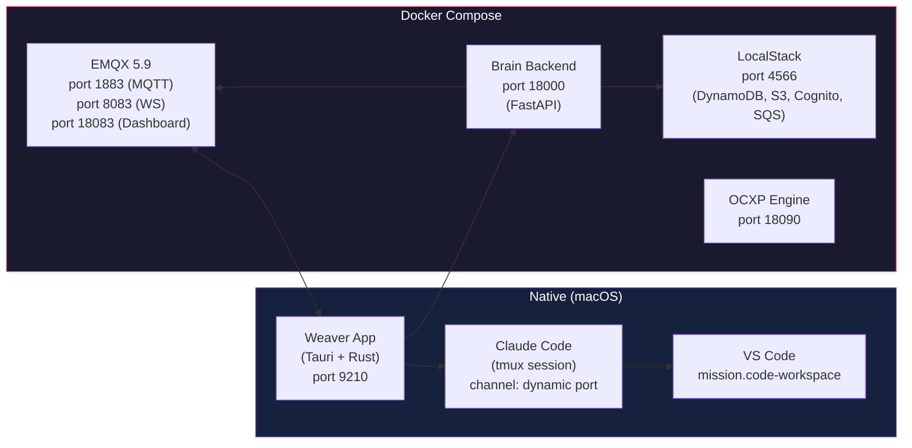

# Local Development Setup

Complete guide for running the full Weaver stack locally with Docker Compose (LocalStack + EMQX + Brain).

## Prerequisites

- Docker Desktop
- Bun (`brew install bun`)
- Rust + Cargo
- Node.js 20+
- tmux (`brew install tmux`)
- Claude Code CLI (`npm install -g @anthropic-ai/claude-code`)
- AWS CLI + profile `wds_dev` configured
- EMQX device credentials provisioned

## Architecture (Local)



## Step 1: Start Infrastructure

```bash
cd ~/Sonic-Web-Dev/contexthub/contexthub-platform

# Start LocalStack (always needed)
docker compose up localstack -d

# Start EMQX (for MQTT)
docker compose --profile weaver up emqx -d

# Start Brain backend (for mission API)
docker compose --profile brain up brain-backend -d

# Or start everything at once
docker compose --profile full up -d
```

### Verify Services

```bash
# LocalStack
curl -s http://localhost:4566/_localstack/health | python3 -m json.tool

# EMQX Dashboard
open http://localhost:18083  # admin / public

# Brain API
curl -s http://localhost:18000/health

# EMQX MQTT (test with mqttx)
mqttx pub -h localhost -p 1883 -u "andre-mac" -P "weaver-dev-secret" -t "test/ping" -m "hello"
```

## Step 2: Provision EMQX Devices

First time only -- creates device accounts in EMQX:

```bash
cd ~/Sonic-Web-Dev/contexthub/contexthub-platform
bash scripts/provision-mqtt-devices.sh
```

Creates accounts: `andre-mac`, `andre-mac-mini`, `cloud-1`, `cloud-2`, `weaver-console`.
Default password: `weaver-dev-secret`.

## Step 3: Configure Weaver

Settings at `~/.config/contexthub-weaver/settings.json`:

```json
{
  "mqttHost": "localhost",
  "mqttPort": 1883,
  "mqttUsername": "andre-mac",
  "mqttPassword": "weaver-dev-secret",
  "instanceId": "weaver-andre-mac",
  "workspace": "dev",
  "workspaceMount": "/Users/andre/Workspace",
  "capacity": 2,
  "brainApiUrl": "http://localhost:18000",
  "autoConnect": true
}
```

## Step 4: Start Weaver

```bash
cd ~/Sonic-Web-Dev/contexthub/contexthub-weaver
npx tauri dev
```

Weaver will:
- Auto-connect to EMQX on localhost:1883
- Start heartbeat publishing
- Listen for MQTT messages
- Start web server on port 9210

## Step 5: Publish Test Mission

The test script simulates Brain publishing a mission via MQTT:

```bash
cd ~/Sonic-Web-Dev/contexthub/contexthub-weaver

# Publish all retained state (plan, phases, todos)
./scripts/mqtt-test-mission.sh

# Also send a phase assignment (triggers execution)
./scripts/mqtt-test-mission.sh assign
```

This publishes:
- 1 registry message (mission discovery)
- 1 plan state (title, scope, objectives)
- 4 phase states (config, execution targets)
- 24 todo states (specs with behavior/constraints)
- 1 phase assignment (P0 with 7 todos)

Test mission: **Cascade Delete & Ghost Data Cleanup** (from production Brain API).

## Step 6: Start Claude Code Session

### Option A: Weaver auto-spawns (autonomous)

When Weaver receives an assignment via MQTT, it spawns Claude Code in tmux:

```bash
# The assignment triggers this automatically:
tmux new-session -d -s weaver-68206c25 -c /path/to/weaver \
  "unset CLAUDE_CODE_USE_BEDROCK; \
   export CLAUDE_CODE_EXPERIMENTAL_AGENT_TEAMS=1; \
   claude --dangerously-load-development-channels server:weaver \
          --dangerously-skip-permissions \
          --plugin-dir ~/Sonic-Web-Dev/contexthub/contexthub-weaver/weaver-plugin"
```

Note: `unset CLAUDE_CODE_USE_BEDROCK` is required because channels need claude.ai auth, not Bedrock.

### Option B: Manual start (interactive)

```bash
cd /Users/andre/Workspace/.worktrees/68206c25/weaver

unset CLAUDE_CODE_USE_BEDROCK
export CLAUDE_CODE_EXPERIMENTAL_AGENT_TEAMS=1

claude --dangerously-load-development-channels server:weaver \
       --dangerously-skip-permissions \
       --plugin-dir ~/Sonic-Web-Dev/contexthub/contexthub-weaver/weaver-plugin
```

### Option C: VS Code workspace

Open from Finder (not from a Claude Code terminal):
```
/Users/andre/Workspace/.worktrees/68206c25/mission.code-workspace
```

VS Code auto-runs the tmux attach task on workspace open.

## Step 7: Push Assignments via Channel

Once Claude Code is running with the channel, push assignments:

```bash
# Read the channel port
PORT=$(cat /Users/andre/Workspace/.worktrees/68206c25/weaver/.weaver/channel-port)

# Push a phase assignment
curl -X POST "http://127.0.0.1:$PORT" \
  -H "Content-Type: application/json" \
  -d '{
    "type": "assignment",
    "mission_id": "68206c25",
    "phase_id": "P0",
    "content": "Execute Phase P0 (7 todos). Read .weaver/specs/ for each todo spec.",
    "todos": ["P0.1", "P0.2", "P0.3", "P0.4", "P0.5", "P0.6", "P0.7"]
  }'

# Push next phase after completion
curl -X POST "http://127.0.0.1:$PORT" \
  -H "Content-Type: application/json" \
  -d '{
    "type": "assignment",
    "mission_id": "68206c25",
    "phase_id": "P1",
    "content": "Execute Phase P1 (7 todos). Read .weaver/specs/ for P1.1-P1.7.",
    "todos": ["P1.1", "P1.2", "P1.3", "P1.4", "P1.5", "P1.6", "P1.7"]
  }'
```

## Step 8: Monitor

### tmux (watch Claude work)
```bash
tmux attach -t weaver-68206c25
# Detach: Ctrl+B then D
```

### Channel SSE (debug stream)
```bash
PORT=$(cat /path/to/weaver/.weaver/channel-port)
curl -N "http://127.0.0.1:$PORT/events"
```

### Weaver Dashboard
Open the Weaver desktop app (tray icon) -> Dashboard -> Tasks tab.

### EMQX Dashboard
```
http://localhost:18083
```
Check connected clients, message throughput, retained messages.

### Weaver Debug Logs
In the Weaver app, go to the Debug tab to see all MQTT, hook, and channel events.

## Port Reference

| Service | Port | Protocol |
|---------|------|----------|
| LocalStack | 4566 | HTTP |
| EMQX MQTT | 1883 | TCP |
| EMQX WS | 8083 | WebSocket |
| EMQX Dashboard | 18083 | HTTP |
| Brain API | 18000 | HTTP |
| OCXP Engine | 18090 | HTTP |
| Weaver Web Server | 9210 | HTTP/WS |
| Channel Server | dynamic | HTTP |

## Docker Compose Profiles

| Profile | Services |
|---------|----------|
| (default) | localstack, terraform-init |
| `brain` | + brain-backend |
| `weaver` | + emqx, redis, kafka |
| `ocxp` | + ocxp-engine |
| `agentcore` | + agentcore |
| `full` | all services |

```bash
# Just MQTT for Weaver testing
docker compose --profile weaver up emqx -d

# Brain + MQTT
docker compose --profile brain --profile weaver up -d

# Everything
docker compose --profile full up -d
```

## Troubleshooting

### EMQX not connecting
- Check EMQX is running: `docker ps | grep emqx`
- Verify port: `lsof -i :1883`
- Test with mqttx: `mqttx pub -h localhost -p 1883 -t test -m hello`

### Channel "not available"
- Channels require claude.ai login, not Bedrock
- Add `unset CLAUDE_CODE_USE_BEDROCK` before starting claude
- Check Claude Code version: `claude --version` (needs 2.1.80+)

### Workspace trust dialog
- `--dangerously-skip-permissions` should bypass it
- If not, accept it once manually -- it's remembered

### VS Code "nested session" error
- Open VS Code from Finder, not from a Claude Code terminal
- The `CLAUDECODE` env var causes the conflict

### tmux attach blank screen
- Press `Enter` or `Ctrl+B then L` to redraw
- Check session exists: `tmux list-sessions | grep weaver`

### Weaver port 9210 in use
- Kill old process: `lsof -ti:9210 | xargs kill -9`
- Or kill old Weaver: `pkill -f contexthub-weaver`
